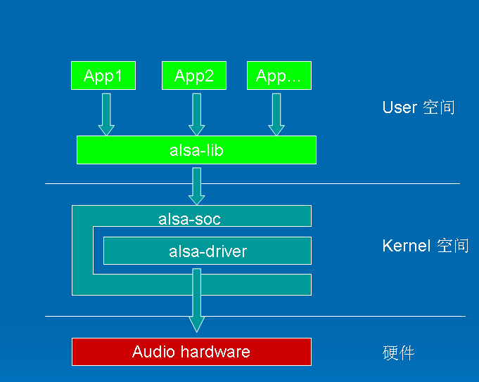

ALSA架构简介



**ALSA设备文件结构**

  我们从alsa在linux中的设备文件结构开始我们的alsa之旅. 看看我的电脑中的alsa驱动的设备文件结构:

```bash
$ cd /dev/snd
$ ls -l
crw-rw----+ 1 root audio 116, 8 2011-02-23 21:38 controlC0
crw-rw----+ 1 root audio 116, 4 2011-02-23 21:38 midiC0D0
crw-rw----+ 1 root audio 116, 7 2011-02-23 21:39 pcmC0D0c
crw-rw----+ 1 root audio 116, 6 2011-02-23 21:56 pcmC0D0p
crw-rw----+ 1 root audio 116, 5 2011-02-23 21:38 pcmC0D1p
crw-rw----+ 1 root audio 116, 3 2011-02-23 21:38 seq
crw-rw----+ 1 root audio 116, 2 2011-02-23 21:38 timer
$
```

  我们可以看到以下设备文件:

- controlC0 -->         用于声卡的控制，例如通道选择，混音，麦克风的控制等
- midiC0D0 -->        用于播放midi音频
- pcmC0D0c --〉        用于录音的pcm设备
- pcmC0D0p --〉        用于播放的pcm设备
- seq --〉            音序器
- timer --〉            定时器

其中，C0D0代表的是声卡0中的设备0，pcmC0D0c最后一个c代表capture，pcmC0D0p最后一个p代表playback，这些都是alsa-driver中的命名规则。

在include/sound/core.h中，定义了以下设备类型：

```c
#define	SNDRV_DEV_TOPLEVEL	((__force snd_device_type_t) 0)
#define	SNDRV_DEV_CONTROL	((__force snd_device_type_t) 1)
#define	SNDRV_DEV_LOWLEVEL_PRE	((__force snd_device_type_t) 2)
#define	SNDRV_DEV_LOWLEVEL_NORMAL ((__force snd_device_type_t) 0x1000)
#define	SNDRV_DEV_PCM		((__force snd_device_type_t) 0x1001)
#define	SNDRV_DEV_RAWMIDI	((__force snd_device_type_t) 0x1002)
#define	SNDRV_DEV_TIMER		((__force snd_device_type_t) 0x1003)
#define	SNDRV_DEV_SEQUENCER	((__force snd_device_type_t) 0x1004)
#define	SNDRV_DEV_HWDEP		((__force snd_device_type_t) 0x1005)
#define	SNDRV_DEV_INFO		((__force snd_device_type_t) 0x1006)
#define	SNDRV_DEV_BUS		((__force snd_device_type_t) 0x1007)
#define	SNDRV_DEV_CODEC		((__force snd_device_type_t) 0x1008)
#define	SNDRV_DEV_JACK          ((__force snd_device_type_t) 0x1009)
#define	SNDRV_DEV_LOWLEVEL	((__force snd_device_type_t) 0x2000)
```

通常，我们更关心的是pcm和control这两种设备。

**驱动的代码文件结构**

在Linux2.6代码树中，Alsa的代码文件结构如下：

  

```bash
sound
      /core
           /oss
           /seq
      /ioctl32
      /include
      /drivers
      /i2c
      /synth
          /emux
      /pci
          /(cards)
      /isa
          /(cards)
      /arm
      /ppc
      /sparc
      /usb
      /pcmcia /(cards)
      /oss
      /soc
          /codecs
```


- core        该目录包含了ALSA驱动的中间层，它是整个ALSA驱动的核心部分
- core/oss    包含模拟旧的OSS架构的PCM和Mixer模块
- core/seq    有关音序器相关的代码
- include     ALSA驱动的公共头文件目录，该目录的头文件需要导出给用户空间的应用程序使用，通常，驱动模块私有的头文件不应放置在这里
-  drivers      放置一些与CPU、BUS架构无关的公用代码
- i2c         ALSA自己的I2C控制代码
- pci         pci声卡的顶层目录，子目录包含各种pci声卡的代码
- isa         isa声卡的顶层目录，子目录包含各种isa声卡的代码
- soc        针对system-on-chip体系的中间层代码
- soc/codecs  针对soc体系的各种codec的代码，与平台无关

 
