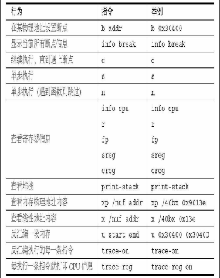

本系列是我按照书籍《Orange S：一个操作系统的实现》，自己亲自动手写一个自己的操作系统，希望以此来提
高自己的C语言的编程能力和对操作系统的认识。由于书出版时间比较早，和实际有点出入，我就按照我实际过
程将它们总结下来。本章是将书中的第一二章合在一起。

## 一、准备工作
### 硬件
Windows系统电脑
### 软件
虚拟机
Bochs-2.6.10
汇编编译器NASM

## 二、新建源代码文件夹
我在虚拟机的Linux环境下新建的一个XOS，同时新建chapter2文件夹存放这章源文件，新建一个boot.asm文件，并将以下内容写到文件中。
``` assembly
        org     07c00h                  ; 告诉编译器程序加载到7c00处
        mov     ax, cs
        mov     ds, ax
        mov     es, ax
        call    DispStr                 ; 调用显示字符串例程
        jmp     $                       ; 无限循环
DispStr:
        mov     ax, BootMessage
        mov     bp, ax                  ; ES:BP = 串地址
        mov     cx, 16                  ; CX = 串长度
        mov     ax, 01301h              ; AH = 13,  AL = 01h
        mov     bx, 000ch               ; 页号为0(BH = 0) 黑底红字(BL = 0Ch,高亮)
        mov     dl, 0
        int     10h                     ; 10h 号中断
        ret
BootMessage:            db      "Hello, OS world!"
times   510-($-$$)      db      0       ; 填充剩下的空间，使生成的二进制代码恰好为512字节
dw      0xaa55                          ; 结束标志
```

## 三、安装GCC和NASM
``` bash
sudo apt-get install build-essential nasm
```

## 四、编译生成bin文件
安装好NASM后，执行下面指令将boot.asm编译成bin文件。
``` bash
nasm boot.asm -o boot.bin
```

## 五、安装Bochs
文中使用的bochs是2.3.5版本，运行configure脚本时，即使安装了相关部件也会报错，我在网上查到是由于版本
比较老，因此我换成了2.6.10版的。要安装带调试功能的bochs，要去官网下载压缩包bochs-2.6.10.tar.gz，按照
下面指令进行安装，在安装过程中可能有些问题，具体可以参考https://my.oschina.net/liuzhihe/blog/794036
``` bash
tar vxzf bochs-2.6.10.tar.gz
cd bochs-2.6.10
sudo ./configure --enable-debugger --enable-disasm
sudo make
sudo make install 
```

## 六、Bochs的使用
使用bximage命令生成软盘a.img后，使用dd命令将引导扇区写进软盘，注意boot.bin是从文件夹XOS拷贝或者剪
切到bash安装目录下的，后面类似操作就不赘叙，默认大家都了解。
``` bash
root@xzr-virtual-machine:/home/xzr/download/bochs-2.6.10# bximage
========================================================================
                                bximage
  Disk Image Creation / Conversion / Resize and Commit Tool for Bochs
         $Id: bximage.cc 13481 2018-03-30 21:04:04Z vruppert $
========================================================================

1. Create new floppy or hard disk image
2. Convert hard disk image to other format (mode)
3. Resize hard disk image
4. Commit 'undoable' redolog to base image
5. Disk image info

0. Quit

Please choose one [0] 1

Create image

Do you want to create a floppy disk image or a hard disk image?
Please type hd or fd. [hd] fd

Choose the size of floppy disk image to create.
Please type 160k, 180k, 320k, 360k, 720k, 1.2M, 1.44M, 1.68M, 1.72M, or 2.88M.
 [1.44M] 

What should be the name of the image?
[a.img] 

The disk image 'a.img' already exists.  Are you sure you want to replace it?
Please type yes or no. [no] yes

Creating floppy image 'a.img' with 2880 sectors

The following line should appear in your bochsrc:
  floppya: image="a.img", status=inserted
root@xzr-virtual-machine:/home/xzr/download/bochs-2.6.10# dd if=boot.bin of=a.img bs=512 count=1 conv=notrunc
```

### Bochs的配置文件bochsrc
新建一个bochsrc，并将以下内容写到文件中，注意和书中略有不同，主要是keyboard，具体原因可以百度。
``` 配置
###############################################################
# Configuration file for Bochs
###############################################################

# how much memory the emulated machine will have
megs: 32

# filename of ROM images
romimage: file=$BXSHARE/BIOS-bochs-latest
vgaromimage: file=$BXSHARE/VGABIOS-lgpl-latest

# what disk images will be used 
floppya: 1_44=a.img, status=inserted

# choose the boot disk.
boot: floppy

# where do we send log messages?
log: bochsout.txt

# disable the mouse
mouse: enabled=0

# enable key mapping, using US layout as default.
keyboard: keymap=$BXSHARE/keymaps/x11-pc-us.map
```

### 启动，输入以下命令
``` bash
 bochs -f bochsrc
```

### 调试系统

按照书中的步骤就可以尝试着调试，需要注意的是dump_cpu命令，新版本不支持，可以使用r | fp | mmx |sse
| dreg | sreg | creg 这些命令查看相关信息，或者使用help命令查看帮助。

表 2 .1部 分Bochs调试指令

